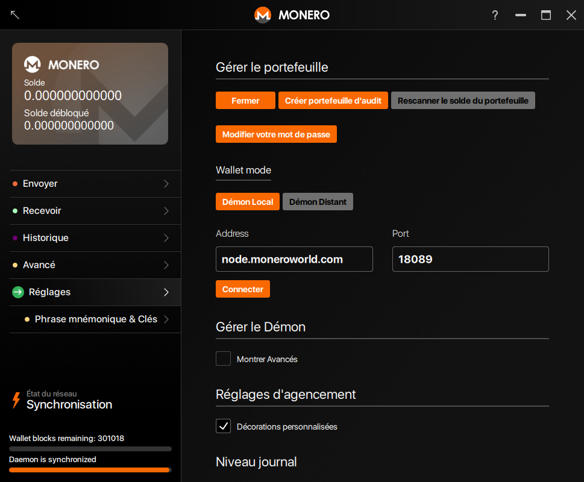
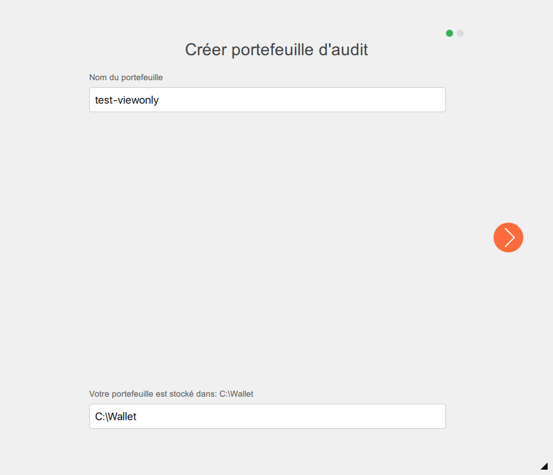
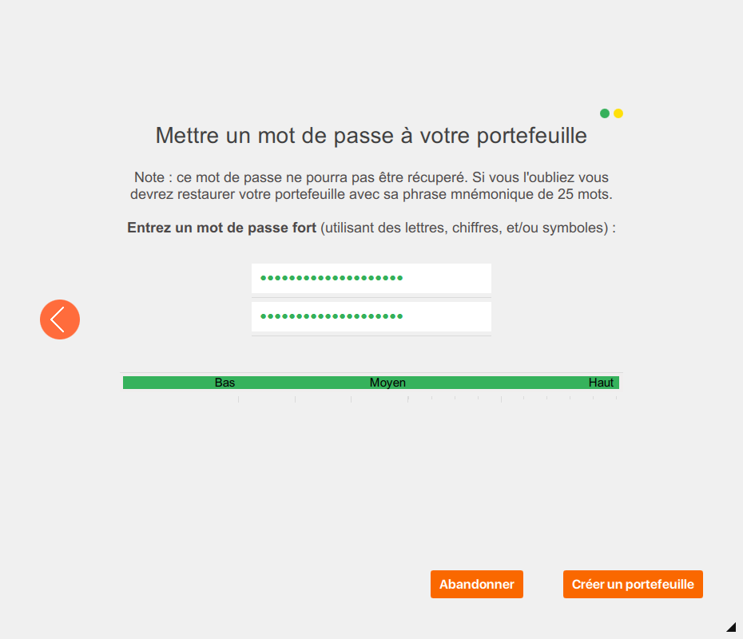

Un portefeuille d'audit ne peut que voir quelles transactions entrantes vous appartiennent. Il ne peut pas dépenser vos Moneroj, en fait il ne peut même pas voir les transactions sortantes de votre portefeuille. Cela rend le portefeuille d'audit particulièrement intéressant pour :

* Les développeurs écrivant des librairies de validation de paiements ;
* Les utilisateurs validant les transactions entrantes sur des portefeuilles froids.

### Créer un portefeuille d'audit

Vous pouvez créer un portefeuille d'audit depuis n'importe quel portefeuille existant.

#### CLI

Ouvrez un portefeuille existant ou créez en un nouveau en utilisant `monero-wallet-cli`. Dans le portefeuille, tapez `address` et `viewkey` pour afficher l'adresse et la clef privée d'audit du portefeuille. Tapez `exit` pour fermer le portefeuille.

Ensuite, créez votre portefeuille d'audit en tapant `monero-wallet-cli --generate-from-view-key nom-du-portefeuille`. Le dernier argument sera le nom du fichier de votre portefeuille. Vos `adresse standard` (`Standard address`) et `clef d'audit` (`View key`) vous seront demandées par le portefeuille. Collez l'adresse originelle de votre portefeuille et la clef privée d'audit. Puis, appuyez sur la touche Entrée et confirmez un mot de passe pour pour votre nouveau portefeuille afin de terminer l'opération.

#### GUI

Ouvrez un portefeuille existant ou créez en un nouveau en utilisant `monero-wallet-gui`. Dans le portefeuille, allez à la page `réglages` :

Cliquez sur `Créer portefeuille d'audit`, Puis donnez lui un nom et un emplacement de stockage avant de cliquer sur la flèche `Droite` :

Donnez un mot de passe fort à votre portefeuille d'audit et confirmez-le avant de cliquer sur `Créer un portefeuille`:

Optionnellement, double-cliquez sur la fenêtre de `Succès` pour en copier le message, puis cliquez sur `OK` pour la fermer :

