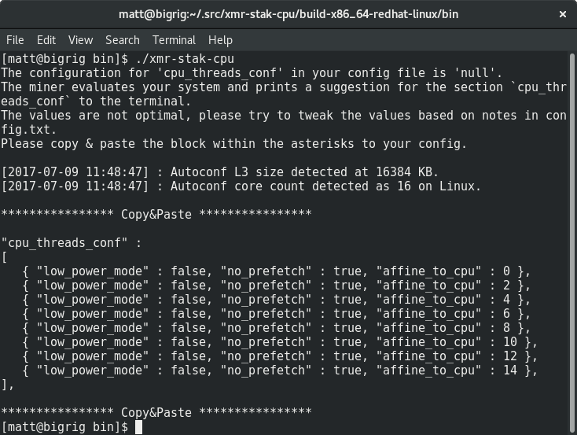
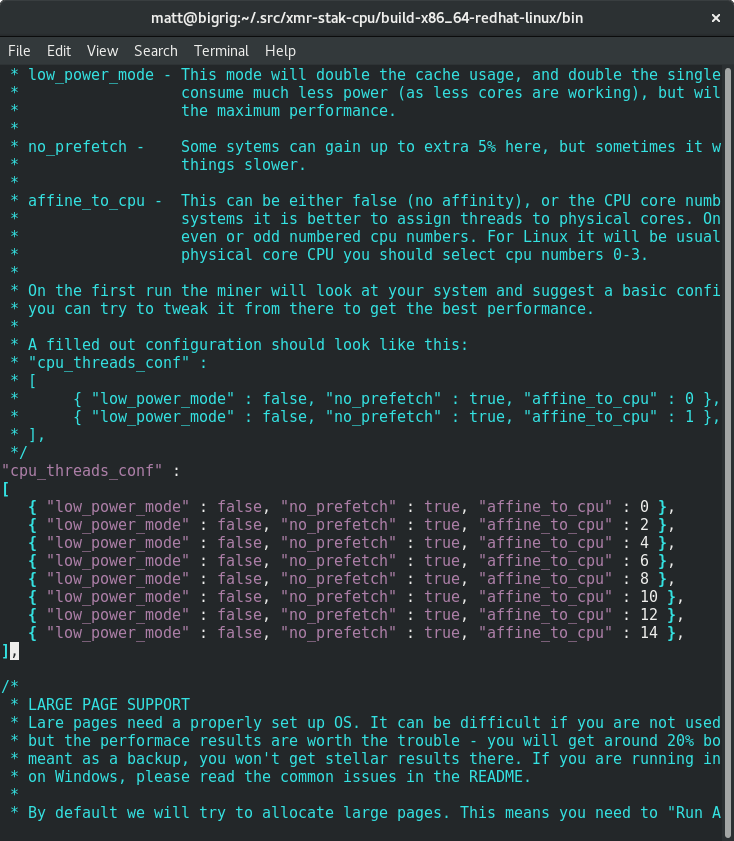
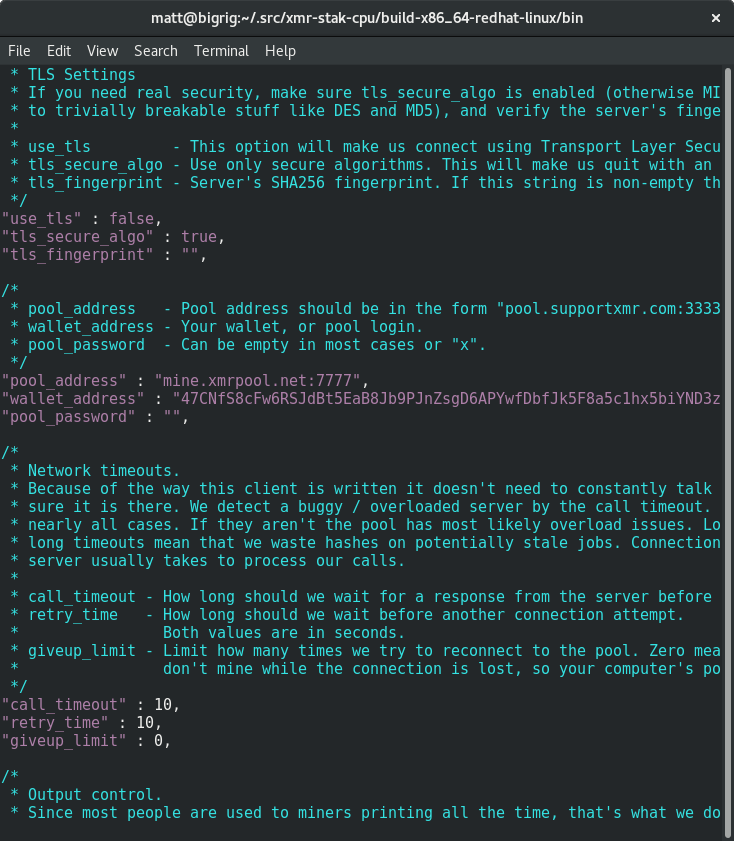
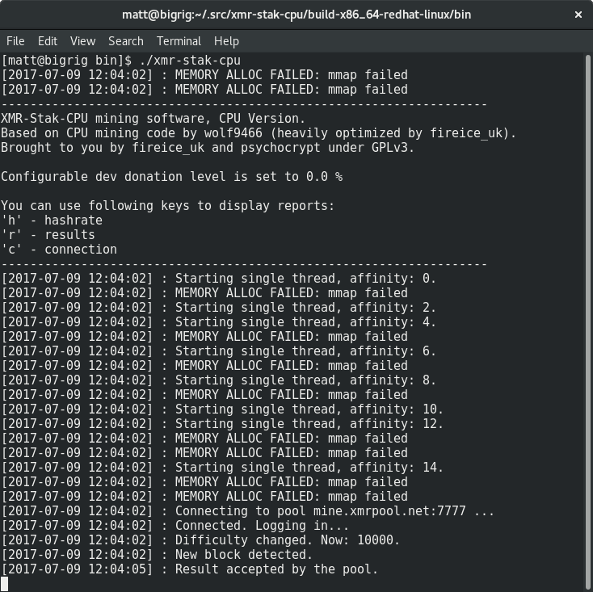

# Selecting a pool

There are many pools to choose from, a list is available at
[moneropools.com](https://moneropools.com). Mining on a larger pool could mean
more frequent payouts, but mining on a smaller pool helps to keep the network
decentralised.

# Selecting a CPU miner

Just like pools, there are a lot of miners to choose from. The one that you
should pick depends on the hardware you want to mine on. This guide will only
use a CPU miner, and will be using
[xmr-stak-cpu](https://github.com/fireice-uk/xmr-stak-cpu). Alternatives include
[wolf's CPUMiner](https://github.com/wolf9466/cpuminer-multi) and
[sgminer-gm](https://github.com/genesismining/sgminer-gm). However, their
configuration is slightly different and will not be covered in this guide.

## For Windows Systems

If you are using a Windows system, the developer of xmr-stak-cpu provides
binaries to download on the
[GitHub release page](https://github.com/fireice-uk/xmr-stak-cpu/releases).

Download `xmr-stak-cpu-win64.zip` and extract it somewhere you'll be able to
find it again.

## For Other Operating Systems

If you're not using Windows, you will have to compile xmr-stak-cpu for yourself,
luckily this isn't as hard as it sounds. Before you can compile the miner, you
will need to install some of its prerequisites.

For Debian-based distros:

    sudo apt-get install libmicrohttpd-dev libssl-dev cmake build-essential

For Red Hat based distros:

	sudo yum install openssl-devel cmake gcc-c++ libmicrohttpd-devel

<!-- TODO: Add dependencies for other operating systems? -->

Following this, you just need to use cmake to generate the build files, run
make and copy the config file:

    mkdir build-$(gcc -dumpmachine)
	cd $_
	cmake ../
	make -j$(nproc)
	cp ../config.txt bin/
	cd bin

Don't celebrate just yet, as the miner needs to be configured. Running the miner
now should give you a block of text to copy and paste:

Open `config.txt` and *replace* the two `"cpu_threads_conf"` lines with the text
you just copied. It should look something like this afterwards:

Scroll down in the file until you see the lines containing `"pool_address"`.
*Replace* the contents of the second set of quotes with the address and port of
the pool you chose earlier. You can find this information on the pool's website.

Put your wallet address between the quotes on the wallet address. You may leave
the password blank unless the pool specifies otherwise.

After this, your config should look something like this:

# Running the miner

**Save the config** file and run the miner!

Some pools allow you to monitor your hashrate by pasting your address into their
website. You can also monitor your hashrate by pressing the `h` key.

# Tuning the miner

You might see nasty messages like this:

	[2017-07-09 12:04:02] : MEMORY ALLOC FAILED: mmap failed

This means that you can get around a 20% hashrate boost by enabling large pages.

## Large pages on Linux

Firstly stop the miner (if it's running), run the following commands to enable
large pages and then start the miner as root:

	sudo sysctl -w vm.nr_hugepages=128
	sudo ./xmr-stak-cpu

## Large pages on Windows

Taken from `config.txt`:

>By default we will try to allocate large pages. This means you need to "Run As Administrator" on Windows
You need to edit your system's group policies to enable locking large pages. Here are the steps from MSDN
1. On the Start menu, click Run. In the Open box, type gpedit.msc.
2. On the Local Group Policy Editor console, expand Computer Configuration, and then expand Windows Settings.
3. Expand Security Settings, and then expand Local Policies.
4. Select the User Rights Assignment folder.
5. The policies will be displayed in the details pane.
6. In the pane, double-click Lock pages in memory.
7. In the Local Security Setting – Lock pages in memory dialog box, click Add User or Group.
8. In the Select Users, Service Accounts, or Groups dialog box, add an account that you will run the miner on
9. Reboot for change to take effect.
